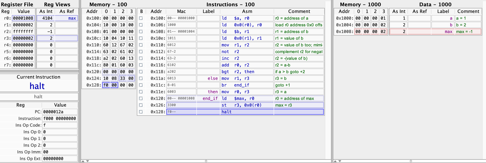

# Code to for-loop: sum 1 to 10
## Intent
Test how Computer handle for-loop, while, until or do-while, do-until structure for high level langauges such as C/C++, Java, Python, etc

## Solution
At low level, cpu only provides rudimentary branch/jump instruction. Branch can only check whether a registry value is zero or greater than zero.

From high level language construct into low level instruction, a de-construction process is needed. Developers should write pseduo-code to decompose a high level language construct statement. 

<table>
<tr><th>C</th><th>Deconstruct in pseudo code</th></tr>
<tr><td valign="top">

```c
for (i=0; i< 10; i++) {
    s += a[i];
}
```

</td><td>

```
loop: 
    j = i - 10;
    goto end_loop if j = 0;
    s += a[i];
    i++;
    goto loop;
end_loop:
    flush registry-value for i to memory i address;
    flush registry-value for s to memory s address;
```

</td></tr>
</table>

## States
### Before run
``` s = -1;  i = -1; a = [2, 4, 6, ..., 20]; ```


### After run
``` s = 110;  i = 10; a = [2, 4, 6, ..., 20]; ```


# Code to if-else: max
## Intent
Same as previous `sum 1 to 10`

## Solution
<table>
<tr><th>C</th><th>Deconstruct in pseudo code</th></tr>
<tr><td valign="top">

```c
max = a > b ? a : b;

// or if-else
if (a > b) {
    max = a;
} else {
    max = b;
}
```

</td><td>

``` 
    j = a - b;
    goto then if j > 0;
    max = b;
    goto end_if;
then:
    max = a;
end_if:
    flush registry-value for max to memory max address;
```

</td></tr>
</table>

## States
### Before run
``` a = 1;  b = 2; max = -1; ```


### After run
``` a = 1;  b = 2; max = 2; ```


# Code to static-method-call
## Intent
How to mimic high level program control flow in assembly, such as method call and return by using jump and program counter (PC)

## Solution
<table>
<tr><th>C</th><th>Deconstruct in pseudo code</th></tr>
<tr><td valign="top">

```c
int x = 6;

void increase() {
    x ++;
}

int main() {
    increase();
    x ++;
}
```

</td><td>

``` 
    execute caller instructions
    before reaching call sub-procedure
    store current-pc + next-instruction-length to register-5
    jump to sub-procedure address
    execute sub-procedure instructions
    after done sub-procedure
    jump back to address of value of register-5
    resume caller instructions right after sub-procedure-call
```

</td></tr>
</table>

## States
### Before run
``` x = 6; ```


### After run
``` x = 8; ```
