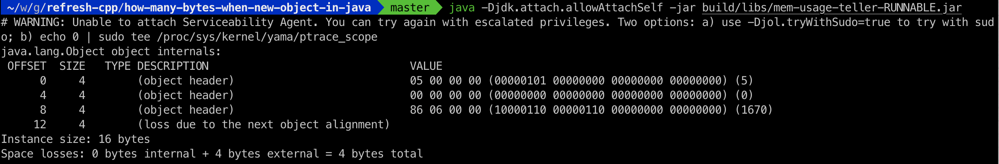
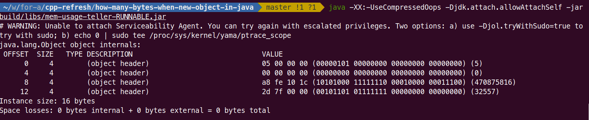
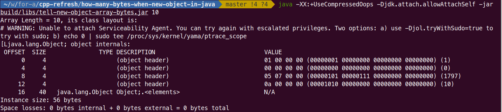
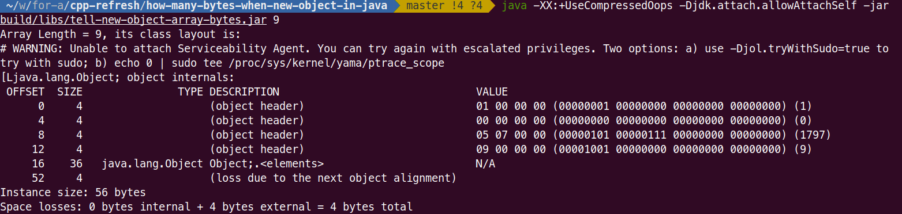
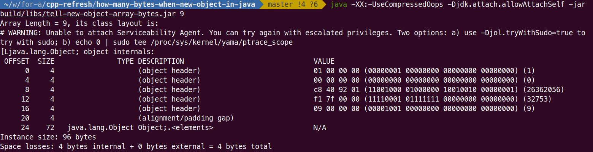
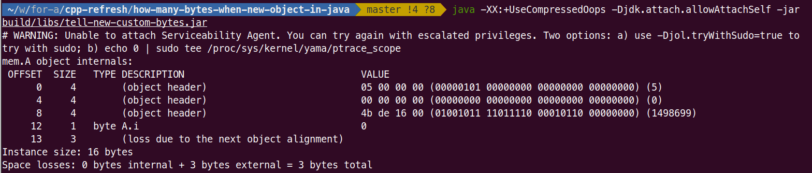
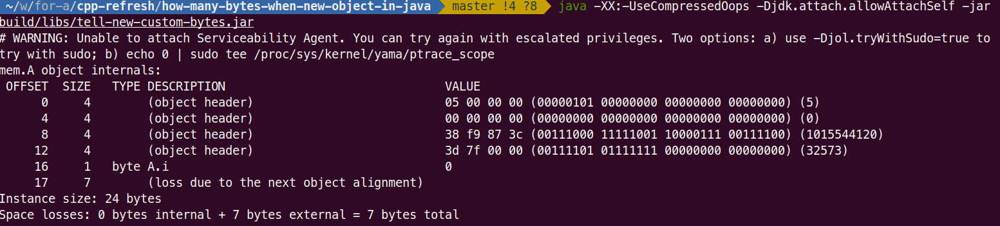

# Object memory model
## Object Header
1. Mark Word (8 bytes)
    * HashCode
    * GC cycle 4 bits, so max 15
    * Lock Mark
    * Biased Locking
    * etc
2. Class Pointer (8 bytes)
    * -XX:+UseCompressedOops (turn on class pointer compression)
        * 4 bytes for class pointer
        * 4 bytes for padding
    * -XX:-UseCompressedOops (turn off class pointer compression)
        * 8 bytes for class pointer
3. Array Length (4 bytes, and only for array type)

## Instance Data
* 1 bytes for boolean, byte
* 2 bytes for short, char 
* 4 bytes for int, float 
* 8 bytes for long, double 
* 8 bytes for reference if not compressed, otherwise 4 bytes when compressed flag is on

## Padding (n*8 bytes)
if sum(object header + instance data) can be divided by 8, no need to pad; otherwise pad to n*8.

# Build projects
* build project

```./gradlew clean build```

* package project

```./gradlew fatJar```

* or build and package togeter

```./gradlew clean build fatJar```

# Run 
## Object
* class pointer compressed

java -XX:+UseCompressedOops -Djdk.attach.allowAttachSelf -jar build/libs/tell-new-object-bytes.jar



total: 16 bytes, but last 4 bytes are purely for padding purpose since it has 12 bytes by itself, which is not 8*n
16 = 8 bytes mark word + 4 compressed class pointer + 4 padding bytes

* no class pointer compressed

java -XX:-UseCompressedOops -Djdk.attach.allowAttachSelf -jar build/libs/tell-new-object-bytes.jar



total: 16 bytes, all bytes are needed, i.e. no padding bytes needed since it is 8*2.
16 = 8 bytes mark word + 8 non-compressed class pointer 

## Object Array (default length = 10, i.e. 10 class pointer or reference)
* class pointer compressed

java -XX:+UseCompressedOops -Djdk.attach.allowAttachSelf -jar build/libs/tell-new-object-array-bytes.jar 10



total: 56 bytes = 8 bytes mark word + 4 compressed cp + 4 bytes array length + 10 * 4 compressed cp + 0 padding bytes

java -XX:+UseCompressedOops -Djdk.attach.allowAttachSelf -jar build/libs/tell-new-object-array-bytes.jar 9



total: 56 bytes = 8 bytes mark word + 4 compressed cp + 4 bytes array length + 9 * 4 compressed cp + 4 padding bytes

* no class pointer compressed

java -XX:-UseCompressedOops -Djdk.attach.allowAttachSelf -jar build/libs/tell-new-object-array-bytes.jar 10


total: 104 bytes = 8 bytes mark word + 8 cp + 4 bytes array length + 10 * 8 compressed cp + 4 padding bytes

java -XX:-UseCompressedOops -Djdk.attach.allowAttachSelf -jar build/libs/tell-new-object-array-bytes.jar 9



total: 96 bytes = 8 bytes mark word + 8 cp + 4 bytes array length + 9 * 8 compressed cp + 4 padding bytes

## Custom Class
* class pointer compressed

java -XX:+UseCompressedOops -Djdk.attach.allowAttachSelf -jar build/libs/tell-new-custom-bytes.jar



total: 16 bytes, but last 3 bytes are purely for padding purpose since it has 13 bytes by itself, which is not 8*n
16 = 8 bytes mark word + 4 compressed class pointer + 1 byte A.i + 3 padding bytes

* no class pointer compressed

java -XX:-UseCompressedOops -Djdk.attach.allowAttachSelf -jar build/libs/tell-new-custom-bytes.jar



total: 24 bytes = 8 bytes mark word + 8 class pointer + 1 byte A.i + 7 bytes padding

## Complex Class
<table>
    <tr>
<th> Main Object </th>
<th> Dependent Object </th>
</tr>
    <tr>
    <td>

```java
class D extends C {
    short aShort;
    int aInt;
    long aLong;
    char aChar;
    float aFloat;
    double aDouble;
    boolean aBoolean;
    E  aObj;
    String  aString = "abcdefg";
    int method1();
    void method3();
}
```

    </td>
    <td>

```java
class B {
    byte aByte;
    Object aObj;
    int method1();
}

class C extends B {
    byte aByte;
    String aString;
    void method2();
}

class E {
    byte i;
    int method4();
}
```

    </td>
</tr>
</table>

* class pointer compressed

java -XX:+UseCompressedOops -Djdk.attach.allowAttachSelf -jar build/libs/tell-new-complex-bytes.jar

```
00 - 03                   (object header) mark word 1
04 - 07                   (object header) mark word 2
08 - 11                   (object header) compressed class pointer
12 - 12              byte B.aByte
13 - 15                   (alignment/padding gap) from B -> C
16 - 19  java.lang.Object B.aObj
20 - 20              byte C.aByte
21 - 23                   (alignment/padding gap) from C -> D
24 - 27  java.lang.String C.aString
28 - 31               int D.aInt
32 - 39              long D.aLong
40 - 47            double D.aDouble
48 - 51             float D.aFloat
52 - 53             short D.aShort
54 - 55              char D.aChar
56 - 56           boolean D.aBloolean
57 - 59                   (alignment/padding gap) from Primitive -> CP
60 - 63             mem.E D.aObj
64 - 67  java.lang.String D.aString
68 - 71                   (loss due to the next object alignment)
Instance size: 72 bytes
Space losses: 9 bytes internal + 4 bytes external = 13 bytes total
```

### Observations:
* When switching from parent class, it should be padded for divisible by 4
* When switching from primitive type to class pointer, it should be padded for divisible by 4
* At the end, it should be padded for divisible by 8 
* All object reference (class pointer) will be 4 bytes when compressed
* In short, memory alignment is 4 bytes and at the end, total alignment is 8 bytes

* class pointer compress off

java -XX:-UseCompressedOops -Djdk.attach.allowAttachSelf -jar build/libs/tell-new-complex-bytes.jar

```
00 - 03                   (object header) mark word 1
04 - 07                   (object header) mark word 2
08 - 15                   (object header) class pointer
16 - 16              byte B.aByte
17 - 23                   (alignment/padding gap) from B -> C
24 - 31  java.lang.Object B.aObj
32 - 32              byte C.aByte
33 - 39                   (alignment/padding gap) from C -> D
40 - 47  java.lang.String C.aString
48 - 51               int D.aInt
52 - 59              long D.aLong
60 - 67            double D.aDouble
68 - 71             float D.aFloat
72 - 73             short D.aShort
74 - 75              char D.aChar
76 - 76           boolean D.aBloolean
77 - 79                   (alignment/padding gap) from Primitive -> CP
80 - 87             mem.E D.aObj
88 - 95  java.lang.String D.aString
Instance size: 96 bytes
Space losses: 17 bytes internal + 0 bytes external = 17 bytes total
``
### Observations:
* When switching from parent class, it should be padded for divisible by 8
* When switching from primitive type to class pointer, it should be padded for divisible by 8
* At the end, it should be padded for divisible by 8 
* All object reference (class pointer) will be 8 bytes when no compression
* In short, memory alignment is 8 bytes and at the end, total alignment is 8 bytes
