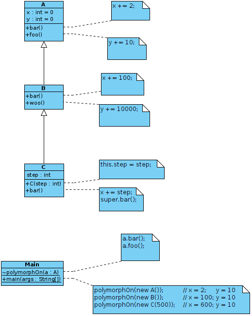
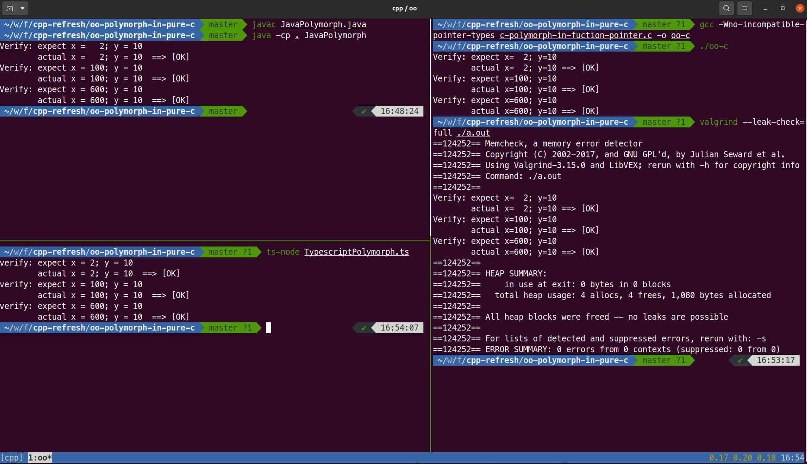
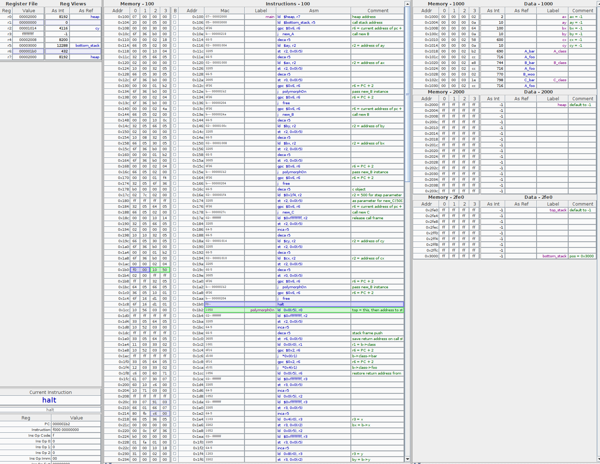

# how to write OO in C function pointer

## Class Diagram C extends B, which extends A

In this hypothetical domain, there are 3 classes, whose relationship is is-a to mimic the inheritance. Each bar method behaves differently to mimic the polymorphism. See diagram:

 

## Implement this in Java, C, TypeScript and Assembly language

[java implementation](./JavaPolymorph.java)

[C implementation](./c-polymorph-in-fuction-pointer.c)

[Assembly Implementation (based on Angela's Computer Theory and Assembly)](./assembly-polymorph.s)

[Typescript Implementation](./TypescriptPolymorph.ts)

## Runtime Snapshot

### Run in Java, C and Typescript

### Run in Assembly

